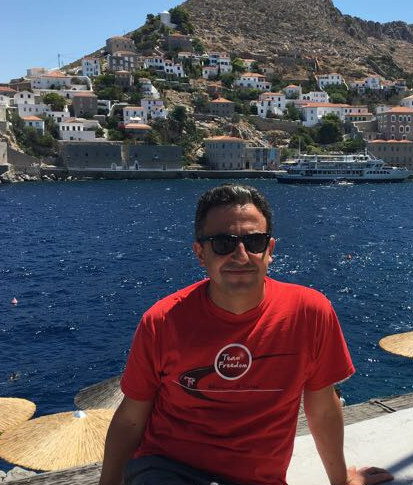

<link rel="stylesheet" href="styles.css" type="text/css">

---

**New: visit my website to follow-up the  Covid19 toll in the World**

**https://covid19data.website**

---

I'm Dhafer Malouche, a Professor from the <a href='http://www.essai.rnu.tn/accueil.htm'> Higher School of Statistics and Information Analysis,</a>  [University of Carthage](http://www.ucar.rnu.tn/Fr/) in Tunisia.

For my everyday work, I use R, Python, H2O, and Spark. In this website I will be sharing many R and Python codes where I show how one can use these softwares to solve Machine Learning, Statistical Modeling, and Data Visualization problems. I would greatly appreciate all feedback, comments, and questions. 

So feel free to [contact me](mailto:dhafer.malouche@essai.u-carthage.tn )

ORCID ID 

<a itemprop="sameAs" content="https://orcid.org/0000-0002-0494-7141" href="https://orcid.org/0000-0002-0494-7141" target="orcid.widget" rel="me noopener noreferrer" style="vertical-align:top;">https://orcid.org/0000-0002-0494-7141</a>

----

[Survey  IAPS](https://survey.zohopublic.com/zs/hTChZP)

